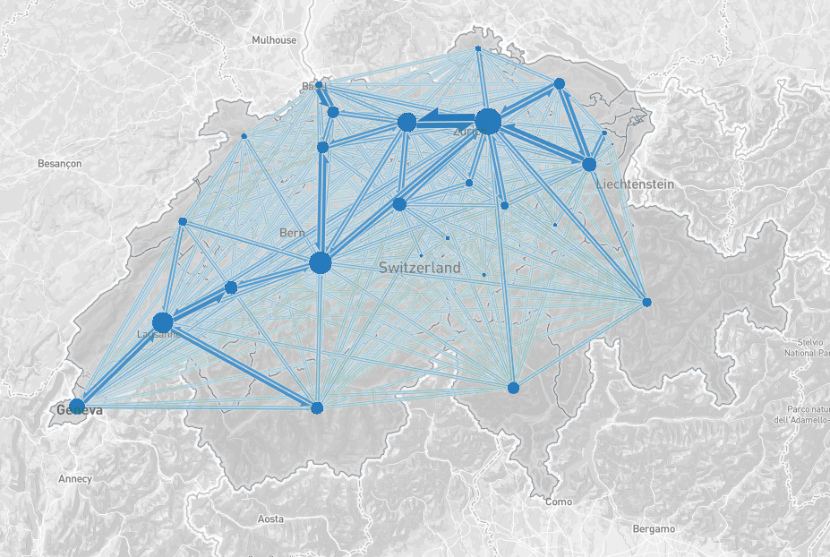

# flow-map.gl

Flow map drawing layer for [deck.gl](http://uber.github.io/deck.gl).

## Developing

    npm install
    MapboxAccessToken=... npm start

Note that `npm start` in the main directory actually runs `examples/main`.
